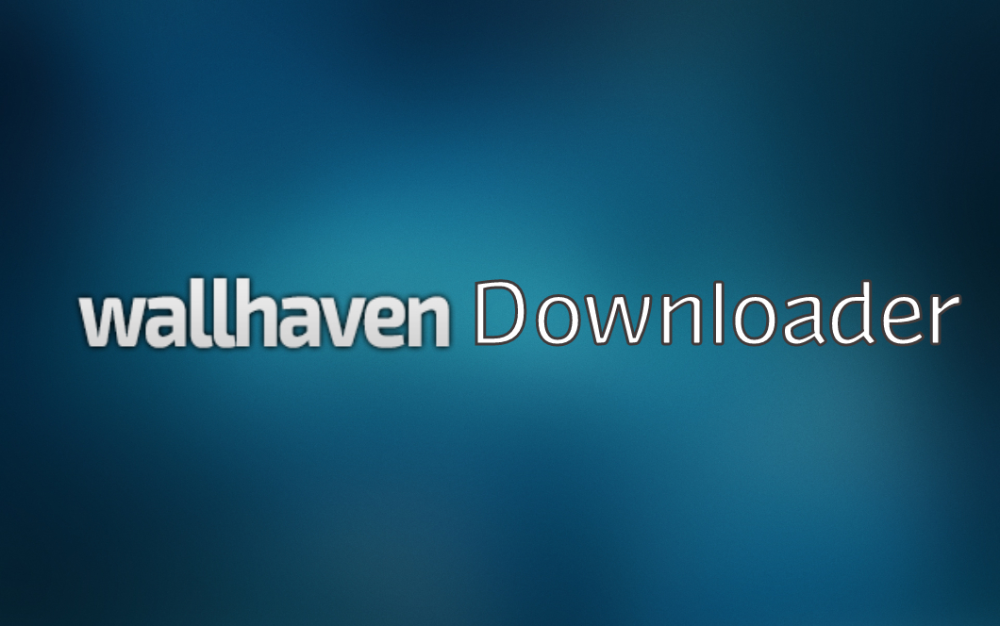

 

---

 

**[WIKI](https://github.com/gregsithole/wallhaven-downloader#-wiki) •
[LICENSE](https://github.com/gregsithole/wallhaven-downloader#%EF%B8%8F-license)**

# ⚠️ License

The wallhaven downloader is free and open-source software licensed under the MIT License. All designs were created by [Greg Sithole](https://github.com/gregsithole) and distributed under Creative Commons license (CC BY-SA 4.0 International).

 

---
